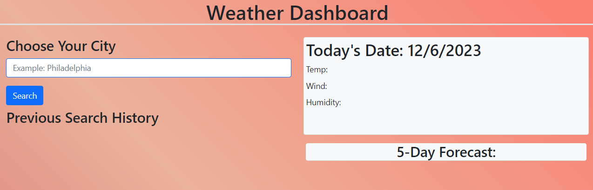
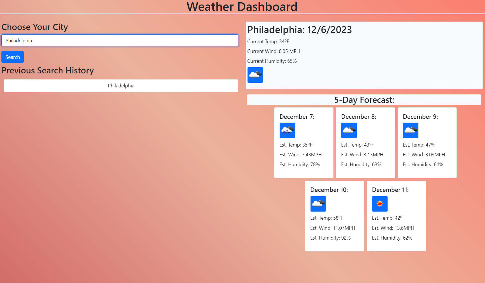

# Weather Tracker Dashboard API

## Description

This weather tracker was created to showcase fetching third party API's to gather data and use it in a custom dashboard.

## Usage

Use the search bar on the left hand side under, "Choose Your City". After typing in a valid city, the right side dashboard will populate with data. If an invalid city is entered, you will be prompted with an error. 

Your search history will popualte under the, "Previous Search History".

### Deployed Dashboard Pre-Search

### Deployed Dashboard Post-Search

### Deployed Link
https://tyler-cav.github.io/WeatherTrackerAPI/

## Credits

Meg Meyers: https://github.com/femke77

## Features

1. History Tracker
2. Current Weather Tracker by City
3. Five Day Forecast For the City